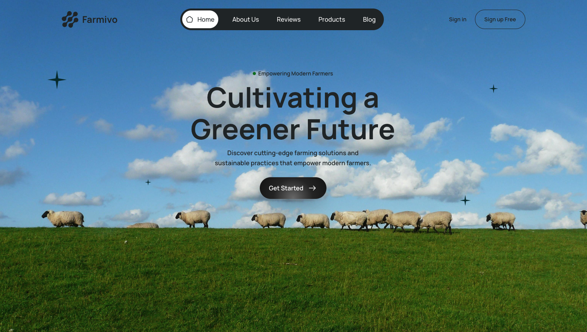

# Farmivo Portfolio Project

## Overview

A single-page website featuring multiple sections including a hero banner, interactive stats, animated image and text carousels, and a comprehensive footer. Built with React and SCSS.

---

## Screenshot

---

## Links

- **GitHub URL:** [GitHub Repository](https://github.com/jenniferokafor/farmivo-landing-page)
- **Live Site URL:** [farmivo-jen-portfolio-project.netlify.app](https://farmivo-jen-portfolio-project.netlify.app/)

---

## Built With

- **Semantic HTML5 markup**
- **SCSS for styling**
- **React for UI components**
- **Custom hooks for interactivity**
- **Responsive design using Flexbox and CSS Grid**
